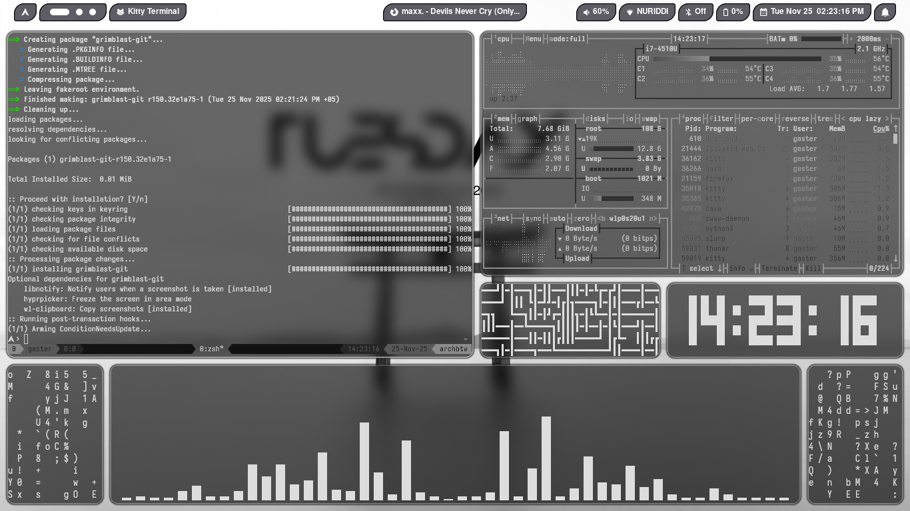
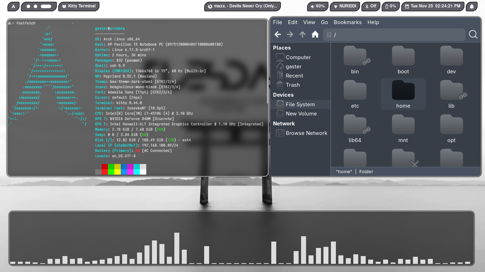

# ❄️ Arktik Light Dotfiles v0.01

**Author:** Abduraxmonov Nuriddin (**SourceCodeSorcerer**)

---

## 🇺🇸 English Version

Welcome to the **Arktik Light Dotfiles**! Thank you for the overwhelming interest in my setup. This repository contains all the configuration files (dotfiles) for my "Arktik Light" rice, offering a clean, light, and customizable Arctic-inspired aesthetic built primarily around the **Hyprland** Wayland compositor.

### ✨ Features Overview

This package includes configurations for several key tools:

| Component | Description | Configuration Folder |
| :--- | :--- | :--- |
| **Compositor** | Hyprland (Tiling Wayland Compositor) | `hyprland` |
| **Bar/Panel** | Hyprpanel | `hyprpanel` |
| **Terminal** | Kitty | `kitty` |
| **App Launcher** | Rofi | `rofi` |
| **Shell** | Zsh with Oh My Zsh | `.zshrc`, `.oh-my-zsh` |
| **Monitoring** | Conky System Monitor | `conky` |
| **Theming** | Custom GTK Theme and Icons | `gtk-theme`, `icons` |
| **Display Manager** | Ly | `ly` |
| **Other** | Wallpapers, GRUB, tmux, mkinitpcio | `wallpapers`, `grub`, `.tmux.conf` |

### 📸 Screenshots

Here is a preview of the setup:

| Screenshot 1 | Screenshot 2 | Screenshot 3 |
| :---: | :---: | :---: |
|  |  |  |

---

### 🛠️ Installation Guide

#### 📹 Installation Video

An in-depth installation video guide is available here: **[YOUTUBE VIDEO LINK HERE]**

> **Please Note:** Before proceeding, ensure you have necessary dependencies like Hyprland, Kitty, Rofi, Zsh, etc., installed on your system.

#### Step-by-Step Guide

The dotfiles are packaged in `arktik-light-dotfiles.zip` and use an included script for easy setup.

1.  **Clone the Repository:**
    ```bash
    git clone [YOUR_REPO_URL_HERE]
    cd arktik-light-v0.01
    ```

2.  **Extract the Archive:**
    ```bash
    unzip arktik-light-dotfiles.zip
    ```

3.  **Run the Installer Script:**
    Navigate to the extracted folder and execute the primary installer script.
    ```bash
    cd arktik-light-dotfiles
    ./installer.sh
    ```
    > **Warning:** Always review the contents of `./installer.sh` before running it to understand the changes it will make to your system.

---
---

## 🇺🇿 O'zbekcha Talqini (Uzbek Version)

**Arktik Light Dotfiles**'ga xush kelibsiz! Mening sozlamalarimga (rice) bo'lgan qiziqishlaringiz uchun katta rahmat. Ushbu omborxona (repository) mening "Arktik Light" setupim uchun barcha konfiguratsiya fayllarini (`dotfiles`) o'z ichiga oladi. U asosan **Hyprland** Wayland kompozitori atrofida qurilgan bo'lib, toza, yorug' va Arctic-uslubidagi estetikani taklif etadi.

### ✨ Xususiyatlarga Umumiy Nazar

Ushbu paket bir nechta asosiy vositalar uchun konfiguratsiyalarni o'z ichiga oladi:

| Komponent (Component) | Tavsif (Description) | Konfiguratsiya Papkasi |
| :--- | :--- | :--- |
| **Kompozitor** | Hyprland (Tiling Wayland Compositor) | `hyprland` |
| **Bar/Panel** | Hyprpanel | `hyprpanel` |
| **Terminal** | Kitty | `kitty` |
| **Ilova Ishga Tushirgich** | Rofi | `rofi` |
| **Qobiq (Shell)** | Zsh (Oh My Zsh bilan) | `.zshrc`, `.oh-my-zsh` |
| **Monitoring** | Conky Tizim Monitori | `conky` |
| **Mavzulashtirish** | Maxsus GTK Mavzusi va Ikonkalar | `gtk-theme`, `icons` |
| **Displey Menejeri** | Ly | `ly` |
| **Boshqalar** | Fon rasmlari, GRUB, tmux, mkinitpcio | `wallpapers`, `grub`, `.tmux.conf` |

### 📸 Skrinshotlar

Setupning ko'rinishi:

| Skrinshot 1 | Skrinshot 2 | Skrinshot 3 |
| :---: | :---: | :---: |
|  |  |  |

---

### 🛠️ O'rnatish Qo'llanmasi

#### 📹 O'rnatish Bo'yicha Video

Batafsil o'rnatish bo'yicha video qo'llanma shu yerda mavjud: **[YOUTUBE VIDEO LINK HERE]**

> **Iltimos E'tibor Bering:** Davom etishdan oldin, tizimingizda Hyprland, Kitty, Rofi, Zsh kabi kerakli bog'liqliklar (dependencies) o'rnatilganligiga ishonch hosil qiling.

#### Bosqichma-Bosqich Qo'llanma

Dotfiles `arktik-light-dotfiles.zip` ga joylangan va qulay sozlash uchun maxsus skript ishlatiladi.

1.  **Omborxonani Kloni Qiling (Clone the Repository):**
    ```bash
    git clone [YOUR_REPO_URL_HERE]
    cd arktik-light-v0.01
    ```

2.  **Arxivni Ochish (Extract the Archive):**
    ```bash
    unzip arktik-light-dotfiles.zip
    ```

3.  **O'rnatuvchi Skriptni Ishga Tushirish (Run the Installer Script):**
    Ochilgan papkaga o'ting va asosiy o'rnatuvchi skriptni ishga tushiring.
    ```bash
    cd arktik-light-dotfiles
    ./installer.sh
    ```
    > **Ogohlantirish:** Tizimingizga kiritiladigan o'zgarishlarni tushunish uchun `./installer.sh` faylining ichidagi ma'lumotlarni ishga tushirishdan oldin har doim ko'rib chiqing.
